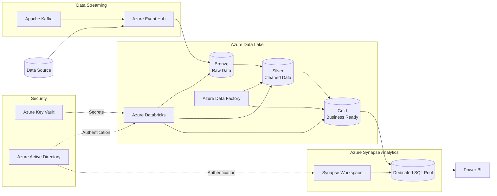
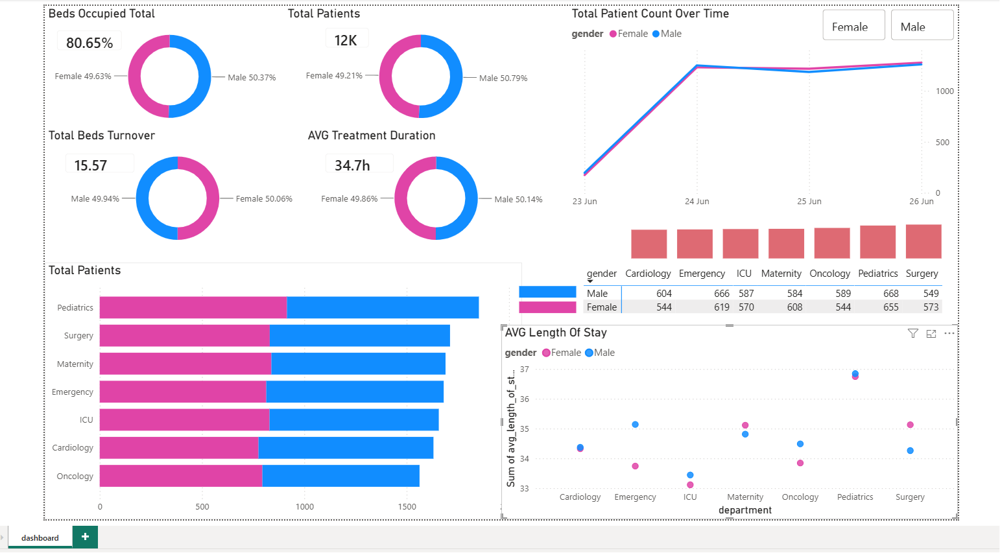

# Azure Real-Time Hospital Patient Flow Analytics Platform

A production-style, end-to-end **Azure Data Engineering** project that demonstrates how real-time patient admission and discharge events can be ingested, processed, transformed, and analyzed using a modern **Medallion Architecture**.

The solution enables hospital administrators to monitor patient flow, bed occupancy, department performance, and operational KPIs through an interactive **Power BI Dashboard**.

---

# Business Problem

## Background

**Midwest Health Alliance (MHA)** is a network of seven hospitals across the Midwest region. During periods of high patient volume, such as seasonal flu outbreaks, hospital administrators struggle to monitor patient movement across departments in real time.

The existing reporting process is delayed and fragmented, making it difficult to identify operational bottlenecks, optimize bed utilization, and improve patient care.

To address these challenges, MHA partnered with **ABC Company** to design and implement a cloud-based real-time analytics platform capable of processing both streaming and batch healthcare data while supporting operational reporting and future scalability.

---

# Business Objectives

The solution was designed to achieve the following objectives:

- Monitor patient admissions and discharges in real time.
- Reduce patient waiting times by identifying operational bottlenecks.
- Track department-level bed occupancy across Emergency, ICU, Surgery, and other departments.
- Provide demographic insights using gender-based and age-based analytics.
- Build a scalable Medallion Architecture for reliable data processing.
- Support schema evolution without interrupting data pipelines.
- Implement Slowly Changing Dimension (SCD Type 2) for maintaining historical dimension data.
- Build a Star Schema optimized for analytical workloads.
- Deliver interactive Power BI dashboards connected to Azure Synapse.
- Secure the platform using Azure Active Directory and Role-Based Access Control (RBAC).

---

# Solution Architecture



---

# Project Architecture

The project follows a modern **Medallion Architecture** to process streaming healthcare data.

## Bronze Layer

- Stores raw JSON data exactly as received from Azure Event Hub.
- Preserves the original source data for replay and auditing.

## Silver Layer

- Cleanses and validates incoming records.
- Handles:
  - Missing values
  - Incorrect timestamps
  - Duplicate patient records
  - Schema validation
- Produces standardized datasets ready for downstream processing.

## Gold Layer

- Creates business-ready datasets.
- Builds Fact and Dimension tables.
- Aggregates KPIs for reporting and analytics.

---

# Technology Stack

| Service | Purpose |
|----------|---------|
| Azure Event Hub | Real-time event ingestion |
| Azure Databricks | Streaming ETL using PySpark |
| Azure Data Lake Storage Gen2 | Bronze, Silver and Gold storage |
| Azure Synapse Analytics | Enterprise Data Warehouse |
| Azure Data Factory | Pipeline orchestration |
| Power BI | Interactive dashboards |
| Python 3.9+ | Data simulation |
| Git | Version control |

---

# Project Structure

```text
real-time-patient-flow-azure/
│
├── databricks-notebooks/
│   ├── 01_bronze_rawdata.py
│   ├── 02_silver_cleandata.py
│   └── 03_gold_transform.py
│
├── simulator/
│   └── patient_flow_generator.py
│
├── sqlpool-queries/
│   └── SQL_pool_queries.sql
│
├── dashboard-screenshot/
│   └── hospital-patient-flow.png
│
├── .gitignore
└── README.md
```

---

# End-to-End Data Pipeline

## 1. Real-Time Data Ingestion

- Simulated patient admission and discharge events are generated using Python.
- Events are streamed into Azure Event Hub.
- Azure Databricks continuously consumes streaming data.

---

## 2. Bronze Layer

- Raw JSON events are stored in Azure Data Lake Storage.
- Original data is retained without transformation.
- Supports replay and audit requirements.

---

## 3. Silver Layer

The Silver layer performs multiple data quality checks including:

- Schema validation
- Null handling
- Duplicate removal
- Timestamp correction
- Data type validation
- Standardization of patient records

---

## 4. Gold Layer

Business-ready datasets are generated including:

- FactPatientFlow
- DimPatient
- DimDepartment


These datasets are optimized for reporting and analytical queries.

---

## 5. Azure Synapse Analytics

Gold layer datasets are loaded into **Azure Synapse Dedicated SQL Pool**.

The warehouse implements a **Star Schema** for high-performance analytical queries.

### Fact Table

- FactPatientFlow

### Dimension Tables

- DimPatient
- DimDepartment


---

## 6. Dashboard & Analytics

Power BI connects directly to **Azure Synapse Dedicated SQL Pool**.

The dashboard provides:

- Current Bed Occupancy
- Department-wise Patient Volume
- Average Wait Time
- Average Length of Stay
- Gender Distribution
- Department Performance
- Interactive Filtering by Gender
- Trend Analysis

---

# Dashboard Preview

# Dashboard Preview

<p align="center">
    
</p>

---

# Data Quality Implementation

The project simulates common healthcare data quality challenges, including:

- Missing admission timestamps
- Duplicate patient identifiers
- Invalid timestamps
- Schema evolution
- Null values
- Incorrect data types

These issues are detected, validated, and corrected during Silver layer processing before being promoted to the Gold layer.

---

# Security

The solution follows Azure security best practices:

- Azure Active Directory authentication
- Azure Key Vault for secret management
- Role-Based Access Control (RBAC)
- Secure service-to-service authentication

---

# Key Business Outcomes

- Built a complete real-time Azure Data Engineering pipeline.
- Implemented a scalable Medallion Architecture.
- Developed an analytics-ready Star Schema in Azure Synapse.
- Delivered an interactive Power BI dashboard for operational insights.
- Improved visibility into patient flow and hospital bed utilization.
- Designed a solution capable of handling schema evolution and historical data tracking.
- Demonstrated enterprise-grade cloud data engineering practices suitable for production environments.

